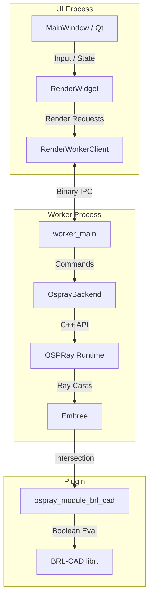
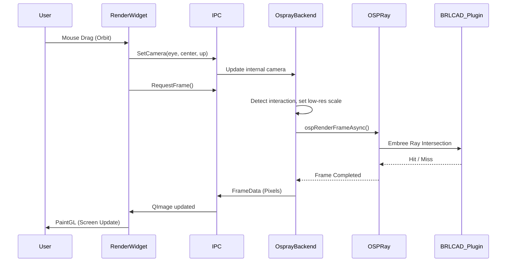

# IBRT Architecture & Software Design

IBRT (Interactive BRL-CAD Ray Tracer) is an interactive visualization tool that bridges BRL-CAD's solid modeling geometry with Intel's OSPRay ray tracing framework. The system is designed to provide real-time, progressive rendering of complex CAD models by utilizing out-of-process rendering and dynamic quality scaling.

## 1. High-Level System Architecture

IBRT is split conceptually into three major domains:
1.  **Frontend (UI Process)**: A Qt-based desktop application responsible for window management, user interaction, camera manipulation, and presenting the final rendered image.
2.  **Backend (Render Worker Process)**: An isolated process that houses the OSPRay runtime. It executes heavy ray-tracing workloads asynchronously to ensure the UI remains responsive.
3.  **Geometry Bridge (OSPRay Plugin)**: A custom OSPRay module (`ospray_module_brl_cad`) that allows OSPRay and Embree to natively intersect BRL-CAD implicit geometry.

## 2. Component Boundaries and Relationships

### 2.1 The Application Frontend (`apps/IBRT`)
-   **`MainWindow`**: The top-level Qt application window. Manages menus, scene loading dialogues, and the lifecycle of the core widgets.
-   **`RenderWidget`**: The primary OpenGL viewport and interaction hub.
    -   Handles input modes (Orbit/Fly) via `InteractionController`.
    -   Paints the incoming frame buffers to the screen.
    -   Translates user inputs into camera transformations and delegates rendering to either an in-process `OsprayBackend` (fallback) or the out-of-process `RenderWorkerClient`.
-   **`RenderWorkerClient`**: The C++ wrapper for managing the worker subprocess. It starts the `worker_main` executable and maintains the IPC connection, providing an asynchronous API for the `RenderWidget` to request frames, update camera matrices, and load scenes.

### 2.2 IPC (Inter-Process Communication)
To prevent OSPRay's heavy CPU utilization or potential crashes from taking down the UI, IBRT uses a custom binary IPC protocol defined in `worker_ipc.h`. 
-   **Transport**: Named Pipes on Windows, UNIX Domain Sockets on Linux/macOS.
-   **Protocol**: A simple header-prefixed binary format (`MessageHeader` with magic bytes, type, and payload size) followed by raw byte payloads (e.g., serialized structs for camera updates, or bulk pixel arrays for frame data).
-   **Message Types**: Command/Response pairs for `LoadObj`, `LoadBrlcad`, `SetCamera`, `Resize`, `RequestFrame`, etc.

### 2.3 The Render Backend (`OsprayBackend`)
`OsprayBackend` acts as the facade over the raw OSPRay C++ API. It is designed to be usable both in-process (for testing/simplicity) and out-of-process (inside the worker).
-   **Scene Management**: Wraps `ospray::cpp::Renderer`, `Camera`, `World`, and manages instances of geometry.
-   **Progressive Rendering**: Implements a state machine for dynamic rendering quality. When the user interacts (e.g., rotating the camera), the backend automatically drops the resolution scale (e.g., 1/16th resolution) and disables accumulation to maintain high framerates. When interaction stops, it progressively refines the image and accumulates samples.
-   **Watchdog / Backoff**: Monitors frame times. If a frame takes longer than a predefined budget, it triggers automatic reductions in Ambient Occlusion (AO) complexity or max path length to prevent the system from stalling.

### 2.4 The Geometry Plugin (`plugins/brl_cad`)
This is the lowest-level boundary, linking OSPRay to BRL-CAD. It compiles as a shared library (`ospray_module_brl_cad`) loaded by the OSPRay runtime.
-   **`BRLCAD` Geometry Class**: Inherits from `ospray::Geometry`. It holds a pointer to the BRL-CAD ray-trace instance (`rt_i`).
-   **ISPC Bridge (`brlcad.ispc`)**: OSPRay and Embree rely heavily on the Intel SPMD Program Compiler (ISPC) for vectorized ray casting. The plugin provides ISPC kernels that Embree calls when a ray hits the bounding box of a BRL-CAD object.
-   **`librt` Interface**: Inside the intersection callback, the plugin bridges from the vectorized ISPC domain back into scalar C++ to call BRL-CAD's `rt_shootray` or evaluate constructive solid geometry (CSG) boolean trees.

## 3. Key Design Decisions

1.  **Process Isolation**: By isolating the `OsprayBackend` in a child process, the Qt UI thread remains perfectly smooth. The OS scheduler prevents OSPRay's TBB thread pools from completely starving the UI.
2.  **External `bext` Dependencies**: IBRT explicitly does *not* vendor OSPRay or Embree. It relies on a pre-built `bext` dependency tree. This keeps the IBRT repository lightweight and cleanly separates the visualization app from the rendering engine's build system.
3.  **Stateless Render Requests**: The IPC protocol is largely imperative and stateless for the client. The UI dictates the *desired* camera and resolution, and the worker attempts to fulfill it as fast as possible, returning whatever progressive stage it achieved.
4.  **C++/ISPC Shared Structs**: To minimize overhead at the ray-intersection boundary, `BRLCADShared.h` defines memory layouts that are identical in both C++ and ISPC, allowing zero-copy pointer passing between OSPRay's vectorized renderer and the BRL-CAD C++ plugin state.
